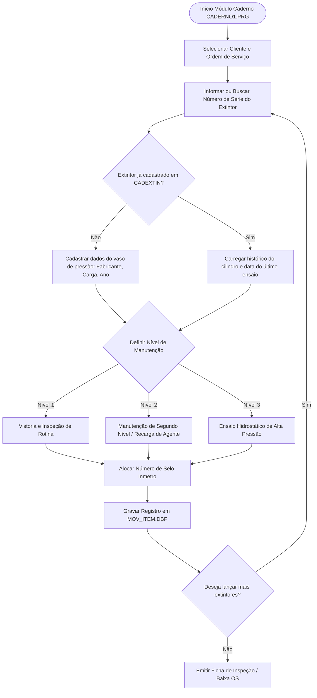

# Fluxograma do Módulo — `caderno_extintores`

> Gerado pelo Arqueólogo do Reversa em 2026-09-18

```mermaid
flowchart TD
    Start([Início Módulo Caderno CADERNO1.PRG]) --> Selection[Selecionar Cliente e Ordem de Serviço]
    Selection --> ReadCyl[Informar ou Buscar Número de Série do Extintor]
    ReadCyl --> CheckExist{Extintor já cadastrado em CADEXTIN?}

    CheckExist -->|Não| NewCyl[Cadastrar dados do vaso de pressão: Fabricante, Carga, Ano]
    CheckExist -->|Sim| LoadCyl[Carregar histórico do cilindro e data do último ensaio]

    NewCyl --> MaintenanceType{Definir Nível de Manutenção}
    LoadCyl --> MaintenanceType

    MaintenanceType -->|Nível 1| Nivel1[Vistoria e Inspeção de Rotina]
    MaintenanceType -->|Nível 2| Nivel2[Manutenção de Segundo Nível / Recarga de Agente]
    MaintenanceType -->|Nível 3| Nivel3[Ensaio Hidrostático de Alta Pressão]

    Nivel1 --> AttachSelo[Alocar Número de Selo Inmetro]
    Nivel2 --> AttachSelo
    Nivel3 --> AttachSelo

    AttachSelo --> SaveItem[Gravar Registro em MOV_ITEM.DBF]
    SaveItem --> CheckMore{Deseja lançar mais extintores?}
    CheckMore -->|Sim| ReadCyl
    CheckMore -->|Não| Finish[Emitir Ficha de Inspeção / Baixa OS]
```
