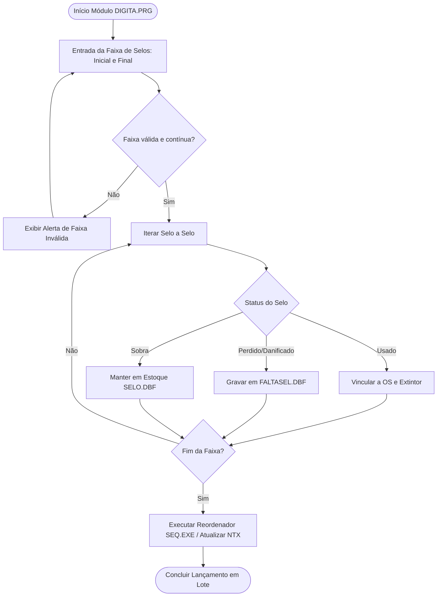

# Fluxograma do Módulo — `digita_selos`

> Gerado pelo Arqueólogo do Reversa em 2026-09-18

```mermaid
flowchart TD
    Start([Início Módulo DIGITA.PRG]) --> EntryRange[Entrada da Faixa de Selos: Inicial e Final]
    EntryRange --> ValidateRange{Faixa válida e contínua?}
    ValidateRange -->|Não| ErrorMsg[Exibir Alerta de Faixa Inválida] --> EntryRange
    ValidateRange -->|Sim| LoopSelos[Iterar Selo a Selo]

    LoopSelos --> CheckStatus{Status do Selo}
    CheckStatus -->|Usado| LinkOS[Vincular a OS e Extintor]
    CheckStatus -->|Perdido/Danificado| LogFault[Gravar em FALTASEL.DBF]
    CheckStatus -->|Sobra| KeepStock[Manter em Estoque SELO.DBF]

    LinkOS --> NextSelo{Fim da Faixa?}
    LogFault --> NextSelo
    KeepStock --> NextSelo

    NextSelo -->|Não| LoopSelos
    NextSelo -->|Sim| RunSeq[Executar Reordenador SEQ.EXE / Atualizar NTX]
    RunSeq --> End([Concluir Lançamento em Lote])
```
