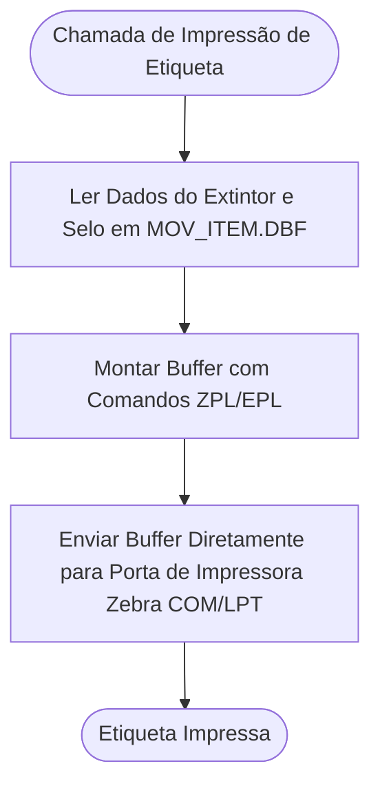

# Fluxograma do Módulo — `etiquetas_zebra`

> Gerado pelo Arqueólogo do Reversa em 2026-09-18

```mermaid
flowchart TD
    Start([Chamada de Impressão de Etiqueta]) --> LoadData[Ler Dados do Extintor e Selo em MOV_ITEM.DBF]
    LoadData --> FormatZPL[Montar Buffer com Comandos ZPL/EPL]
    FormatZPL --> DirectPort[Enviar Buffer Diretamente para Porta de Impressora Zebra COM/LPT]
    DirectPort --> End([Etiqueta Impressa])
```
