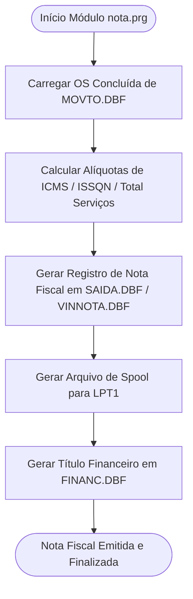

# Fluxograma do Módulo — `faturamento_notas`

> Gerado pelo Arqueólogo do Reversa em 2026-09-18

```mermaid
flowchart TD
    Start([Início Módulo nota.prg]) --> LoadOS[Carregar OS Concluída de MOVTO.DBF]
    LoadOS --> CalculateTax[Calcular Alíquotas de ICMS / ISSQN / Total Serviços]
    CalculateTax --> GenerateNF[Gerar Registro de Nota Fiscal em SAIDA.DBF / VINNOTA.DBF]
    GenerateNF --> PrintSpool[Gerar Arquivo de Spool para LPT1]
    PrintSpool --> UpdateFinanc[Gerar Título Financeiro em FINANC.DBF]
    UpdateFinanc --> End([Nota Fiscal Emitida e Finalizada])
```
