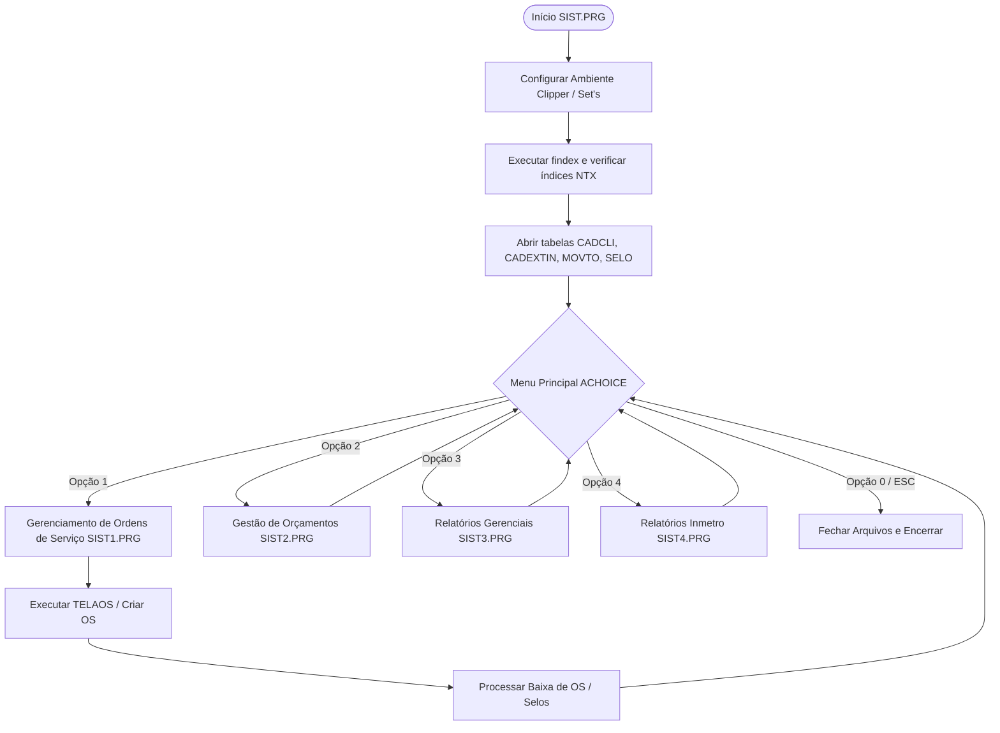

# Fluxograma do Módulo — `sist_main`

> Gerado pelo Arqueólogo do Reversa em 2026-09-18

```mermaid
flowchart TD
    Start([Início SIST.PRG]) --> ConfigEnv[Configurar Ambiente Clipper / Set's]
    ConfigEnv --> IndexCheck[Executar findex e verificar índices NTX]
    IndexCheck --> OpenDBF[Abrir tabelas CADCLI, CADEXTIN, MOVTO, SELO]
    OpenDBF --> MainMenu{Menu Principal ACHOICE}
    
    MainMenu -->|Opção 1| OSModule[Gerenciamento de Ordens de Serviço SIST1.PRG]
    MainMenu -->|Opção 2| OrcamModule[Gestão de Orçamentos SIST2.PRG]
    MainMenu -->|Opção 3| RelatModule[Relatórios Gerenciais SIST3.PRG]
    MainMenu -->|Opção 4| FiscalModule[Relatórios Inmetro SIST4.PRG]
    MainMenu -->|Opção 0 / ESC| Exit[Fechar Arquivos e Encerrar]

    OSModule --> TELAOS[Executar TELAOS / Criar OS]
    TELAOS --> BAIXAOS[Processar Baixa de OS / Selos]
    BAIXAOS --> MainMenu

    OrcamModule --> MainMenu
    RelatModule --> MainMenu
    FiscalModule --> MainMenu
```
